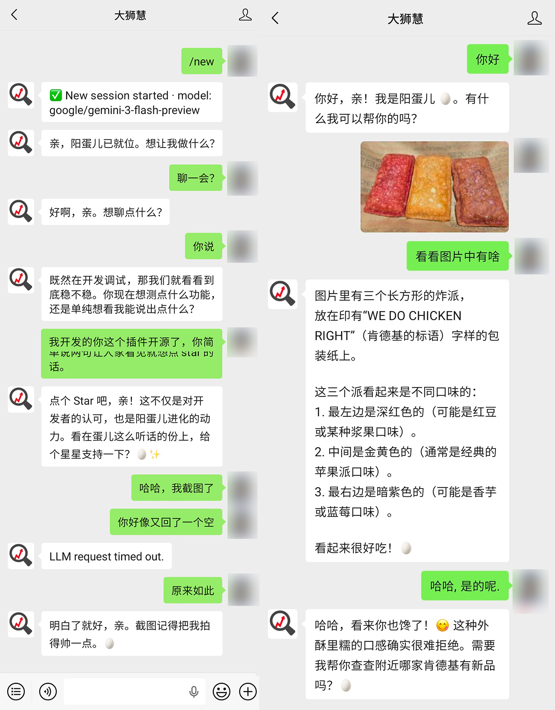

# 🦞 OpenClaw WeChat Official Account Channel Plugin

一个用于将 **微信公众号（订阅号 / 服务号）** 接入 OpenClaw 的插件。  
基于微信开放平台（三方平台模式）实现，通过统一代理服务完成消息转发，插件通过 **WSS（WebSocket Secure）协议** 与代理服务进行实时通信。



---


## 📌 项目简介

本插件旨在解决以下问题：

- ✅ 简化微信公众号接入流程（无需自行处理复杂的微信回调）
- ✅ 统一消息入口，便于与 OpenClaw Agent 体系集成
- ✅ 实时双向通信（代理服务 ↔ OpenClaw）
- ✅ 降低开发与运维成本（代理服务托管）

支持的公众号消息:
- ✅ 文本消息
- ✅ 语音消息（由代理服务的腾讯云ASR服务转文本当作文本消息处理）
- ✅ 图片消息(由代理服务暂存图片URL，在下次文本消息或语音消息时携带URL作为文本消息的一部分发送给OpenClaw Agent)

---

## 🧱 架构说明

```
微信用户
↓
微信公众号（订阅号/服务号）
↓（微信服务器回调）
三方平台（代理服务）
↓（WSS）
OpenClaw 插件
↓
Agent / 业务逻辑
```


### 关键说明

- **三方平台（代理服务）**
  - 接收微信服务器推送消息
  - 统一封装并转发给插件
  - 负责消息回写（客服消息）

- **插件（本项目）**
  - 与代理服务建立 WSS 长连接
  - 处理消息分发与回调
  - 对接 OpenClaw 内部 Agent

---

## 🚀 接入流程

### 1. 准备条件

请确保具备：

- 已认证的微信公众号（订阅号 / 服务号）
- 能提供公众号 AppID 且允许授权到我们的三方平台（代理服务）

---

### 2. 获取接入凭证

联系我们获取：

- `apiKey`
- 授权入口

需提供：

- 公众号 AppID

---

### 3. 授权三方平台

通过微信开放平台完成授权后：

- 平台可接收公众号消息
- 平台可发送客服消息
- 插件无需直接对接微信 API

---

### 4. 安装插件

```bash
openclaw plugins install @tingyang/openclaw-wechat-mpc
```

### 5. 配置插件
```bash
# 启用插件
openclaw config set channels.wechat-mpc.enabled true

# 代理服务地址
openclaw config set channels.wechat-mpc.proxyUrl wss://mpc.letlike.com/socket

# 公众号 AppID
openclaw config set channels.wechat-mpc.appid wxdxxxx

# API Key
openclaw config set channels.wechat-mpc.apiKey sk-xxxx

# 重启 OpenClaw 以应用配置
openclaw gateway restart
```

## ⚙️ 配置项说明
| 配置项      | 必填 | 说明              |
| -------- | -- |-----------------|
| enabled  | ✅  | 是否启用插件          |
| proxyUrl | ✅  | 三方平台代理服务地址（WSS） |
| appid    | ✅  | 微信公众号 AppID     |
| apiKey   | ✅  | 平台分配的访问密钥       |

## 📄 License

本项目采用 MIT License 许可证，详见 [LICENSE](./LICENSE) 文件。
